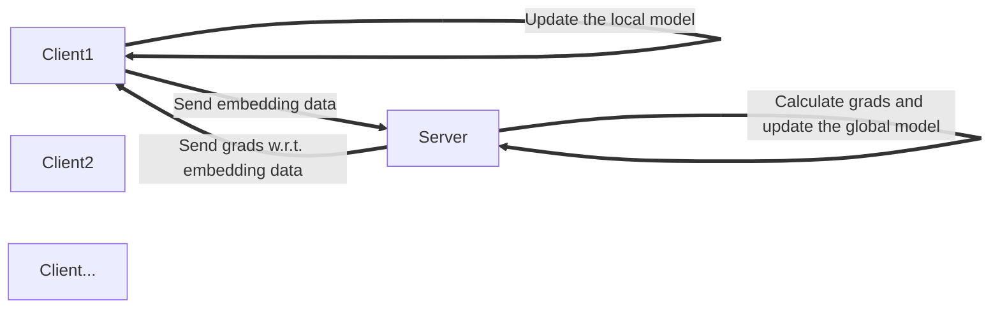

# VFL for LR

[](https://github.com/haochengxia/VFL4LR/blob/master/LICENSE)

Vertical Federated Learning Implementation for Logistic regression (The Simplest Version)



Notice: Without Regard To Privacy Preserving (which means that use [DP](https://en.wikipedia.org/wiki/Differential_privacy), [FE](https://en.wikipedia.org/wiki/Functional_encryption), [FHE](https://en.wikipedia.org/wiki/Homomorphic_encryption), and so forth to protect embeding data or grads in transfering process)

## Prerequisites

* Python, NumPy, libsvm-official

## Run Example

```bash
$ bash ./data/adult/get_data.sh
$ python3 example.py
```

## Example Result

```
$ python3 example.py
[*info] Current Test Loss 9830.097444 Current Test Acc: 0.429904
[*info] Epoch 0 Batch 0 Current Train Loss: 1.034175
[*info] Current Test Loss 9830.097444 Current Test Acc: 0.429904
[*info] Epoch 0 Batch 3 Current Train Loss: 0.723213
[*info] Current Test Loss 8148.651797 Current Test Acc: 0.516067
[*info] Epoch 0 Batch 6 Current Train Loss: 0.537807
[*info] Current Test Loss 7347.467367 Current Test Acc: 0.589458
[*info] Epoch 0 Batch 9 Current Train Loss: 0.386673
[*info] Current Test Loss 7006.886287 Current Test Acc: 0.642879
...
[*info] Current Test Loss 8441.881878 Current Test Acc: 0.759453
[*info] Epoch 4 Batch 3 Current Train Loss: 0.076631
[*info] Current Test Loss 8582.104312 Current Test Acc: 0.760061
[*info] Epoch 4 Batch 6 Current Train Loss: 0.069134
[*info] Current Test Loss 8713.062722 Current Test Acc: 0.760365
[*info] Epoch 4 Batch 9 Current Train Loss: 0.065743
[*info] Current Test Loss 8842.630094 Current Test Acc: 0.760973
```


## Reference

[1] [VAFL: a Method of Vertical Asynchronous Federated Learning](https://arxiv.org/abs/2007.06081)

[2] [VerFedLogistic.jl](https://github.com/ZhenanFanUBC/VerFedLogistic.jl)
